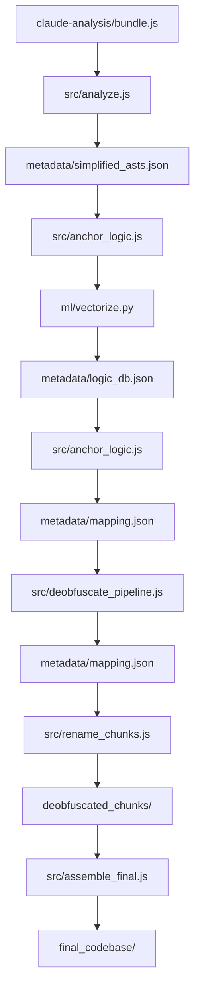

# Claude Code Cascade Analyzer
Pre-processor for CASCADE-style analysis and deobfuscation of Claude Code bundles using structural DNA and LLMs.

# Repository Guidelines

## Project Structure & Module Organization
- `src/`: Core analysis, LLM pipeline, and anchoring/renaming logic.
- `ml/`: Machine Learning components (PyTorch) for structural fingerprinting via Triplet Networks.
- `visualizer/`: WebGL graph viewer (served by `npm run visualize`).
- `docs/`: Technical deep-dives: [Architecture](docs/ARCHITECTURE.md), [NN Internals](docs/NN.md), [Schema](docs/SCHEMA.md), [Environment](docs/ENVIRONMENT.md).
- `cascade_graph_analysis/`: Main workspace for generated outputs, logic registries, and deobfuscated chunks.
- `claude_analysis/`: Source code bundles and analysis references.
- `package.json`: Central command registry and dependency management.
- `run.js`: Task dispatcher for `node run <task>`.
- `knowledge_base.json`: Seed terms for semantic chunk identification.
- `sync_registry.sh`: Helper for synchronizing logic registries.

## TL;DR & Quick Start
1. **Setup**: `npm install` && `python3 -m venv .venv` && `source .venv/bin/activate` && `pip install -r requirements.txt`.
2. **Initialize**: `npm run sync-vocab` && `npm run bootstrap` && `node src/update_registry_from_bootstrap.js`.
3. **Workflow**: `analyze` -> `anchor` -> `deobfuscate` -> `assemble` -> `refine`.

## Build, Training, and Development Commands
- `npm run analyze`: Fetch and chunk the latest Claude bundle.
- `npm run anchor -- <version>`: Structural similarity matching using the trained "Brain" (requires `ml/model.pth`).
- `npm run deobfuscate -- <version> [--skip-vendor]`: LLM-based renaming of proprietary logic.
- `npm run assemble -- <version>`: Reconstruct the deobfuscated file structure.
- `npm run refine -- <version>`: Final LLM pass to restore original control flow and readability.
- `npm run train [--sweep] [--device auto] [--finetune]`: Train or sweep hyperparameters for the Transformer Encoder (`--finetune` loads `ml/model.pth`).
- `npm run bootstrap`: Download and extract DNA from standard libraries (React, Zod, etc.).
- `npm run visualize`: Start the local graph visualizer.
- `npm run sync-vocab`: Sync Babel node types with ML constants.
- `npm run lint`: Auto-format codebase via Prettier.
- `npm run execute`: Convenience command to run `analyze` followed by `deobfuscate`.

## Neural Network (The Brain)
The system uses a **Transformer Encoder** architecture for structural fingerprinting:
- **Architecture**: Multi-Channel Siamese Network (Triplet Loss).
- **Optimal Config**: Embedding Dim: 32, Hidden Dim: 128, Learning Rate: 0.001, Margin: 0.5.
- **Context Window**: Hardware-aware scaling (e.g., 256 nodes for Mac MPS, 2048 for A100).
- **Goal**: Learning **Logic Topology** (Structural DNA) while ignoring "Surface Noise" (mangled names).

## Architecture Flow
- **Structural Analysis**: `src/analyze.js` uses `webcrack` and Markov centrality (`0.85` damping) to identify core logic.
- **Neural Anchoring**: `src/anchor_logic.js` bridges to PyTorch (`ml/`) to generate logic embeddings for code chunks.
- **Knowledge Transfer**: High-similarity matches (>90%) allow transferring deobfuscation results between versions.
- **Assembly**: `src/assemble_final.js` performs path-first aggregation to create the final codebase.

## Configuration & Security
- LLM runs require `.env` (see `.env.example`).
- Use `GEMINI_API_KEY` or `OPENROUTER_API_KEY`; do not commit secrets.
- Large artifacts in `cascade_graph_analysis/` are ignored by git; do not edit manually.
