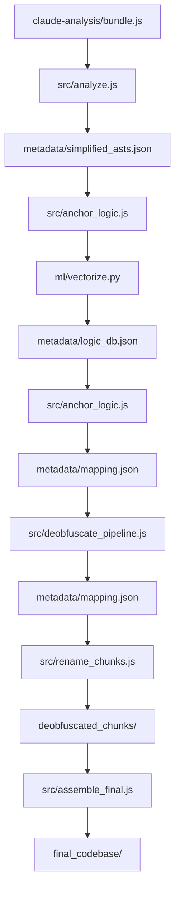

# Repository Guidelines

## Project Structure & Module Organization
- `src/`: Core analysis, LLM pipeline, and anchoring/renaming logic.
- `ml/`: Machine Learning components (PyTorch) for structural fingerprinting.
- `visualizer/`: WebGL graph viewer (served by `npm run visualize`).
- `run.js`: Command dispatcher used by `node run <task>`.
- `knowledge_base.json`: Seed terms for chunk identification.
- `cascade_graph_analysis/`: Generated outputs; treat as build artifacts.
- `claude-analysis/`: Sample input bundles and analysis references.

## Build, Test, and Development Commands
- `npm install`: Install dependencies.
- `npm start`: Run the analyzer (defaults to `./cli.js` or fetches latest bundle).
- `npm run analyze -- path/to/bundle.js`: Analyze a specific bundle (generates `simplified_asts.json`).
- `npm run anchor -- <target> <reference>`: Structural similarity matching via Python NN.
- `npm run deobfuscate -- [version] [--limit N] [--skip-vendor] [--force] [--rename-only]`: Run the LLM pipeline and/or rename pass.
- `npm run assemble -- <version>`: Assemble deobfuscated chunks into a final file structure.
- `npm run visualize`: Start the local visualizer.
- `npm run lint`: Format all files with Prettier.

## Coding Style & Naming Conventions
- Formatting is handled by Prettier (`npm run lint`).
- File names in `src/` use lowercase with underscores (e.g., `deobfuscate_pipeline.js`).

## Testing Guidelines
- No automated test suite is currently present; validate with `npm start` and check `cascade_graph_analysis/`.

## Architecture Overview
- Claude Code bundles are esbuild-style single files (`cli.js`); `src/analyze.js` uses `webcrack` (with `unminify: true`), detects runtime helpers/`INTERNAL_STATE`, and exports **name-agnostic simplified ASTs** for ML.
- **Structural Fingerprinting**: `src/anchor_logic.js` bridges to PyTorch models in `ml/` to generate logic embeddings for code chunks.
- `src/analyze.js` calculates **centrality scores** using a Markov Chain (with `0.85` damping factor) to identify the "brain" of the application.
- The deobfuscation pipeline in `src/deobfuscate_pipeline.js` processes chunks by **Centrality order** and **Category priority** (Founder > Family > Vendor).
- Implements a **Resume Mechanism** via `processed_chunks` in `mapping.json` to avoid re-processing chunks. Use `--force` to override.
- LLM prompts include **Neighbor Roles/DisplayNames** and use a **Candidate Pool** filter to minimize token usage and redundant naming.
- `src/rename_chunks.js` applies Babel renames with refined **scope-aware logic** (inclusive of esbuild wrappers), producing `deobfuscated_chunks/`.
- `src/analyze.js` writes chunk files to `chunks/` and graph/centrality metadata to `metadata/graph_map.json`.
- The deobfuscation ("decryptioning") pipeline in `src/deobfuscate_pipeline.js` calls LLMs via `src/llm_client.js` and saves `metadata/mapping.json`.
- `src/assemble_final.js` (run via `npm run assemble`) performs Path-First Aggregation to create `final_codebase/`.
- `visualizer/` reads `metadata/` plus chunks.

## Commit & Pull Request Guidelines
- Commit history favors short, imperative summaries (e.g., "update pipeline"). Keep messages concise.
- PRs should include: a clear description, how to reproduce/verify, and sample outputs.
- Include screenshots or a short clip for visualizer/UI changes.

## Configuration & Security Notes
- LLM runs require `.env` (see `.env.example`); set `LLM_PROVIDER`, `LLM_MODEL`, and an API key; never commit secrets.
- `src/llm_client.js` defaults to Gemini if unset, selects the matching key, and retries OpenRouter 429s with backoff.
- Use `GEMINI_API_KEY` for Gemini or `OPENROUTER_API_KEY` for OpenRouter; keys with `your_` are treated as invalid.
- Large generated outputs belong in `cascade_graph_analysis/` and should not be hand-edited.
