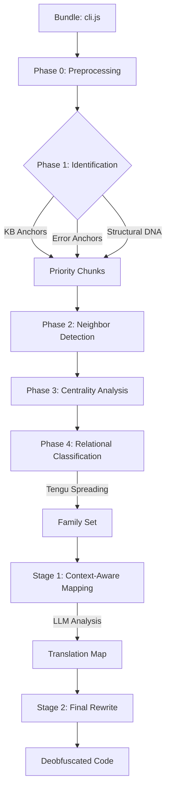

# Claude Code Cascade Analyzer

Pre-processor for CASCADE-style analysis of Claude Code bundles.

## Setup

Install dependencies:

```bash
npm install
```

## Usage

### Analyze

Run the analysis on a bundle. It defaults to searching for `./cli.js` or downloading the latest version from npm if not found.

```bash
npm start
```

To specify a path:

```bash
node analyze.js path/to/bundle.js
```

### Visualize

Start the interactive graph visualizer (WebGL powered by Sigma.js):

```bash
npm run visualize
```

Then open: [http://localhost:3000/visualizer/](http://localhost:3000/visualizer/)

## Workflow

The analysis and deobfuscation process follows a multi-signal **Relational Identity System**:



### Phase 0: Preprocessing & AST Renaming
The target bundle is processed via `webcrack` to unminify code. The analyzer then dynamically detects runtime helpers (lazy loaders, CommonJS wrappers) and the `INTERNAL_STATE` object, applying global renaming to the AST before chunking.

### Phase 1: AST Identification (The DNA Scan)
The tree is split into logical functional chunks. Each chunk is scanned for:
- **Knowledge Base Anchors**: Trigger keywords from `knowledge_base.json`.
- **Error Fingerprinting**: Plain-text error strings (e.g., "Sandbox violation") that survive minification.
- **Structural DNA**: Chunks are tagged if they contain `async function*` (generators) or mutate `INTERNAL_STATE`.

### Phase 2 & 3: Neighbor Detection & Centrality
The analyzer builds a dependency graph of cross-references. A Markov Chain analysis calculates the centrality of each chunk, identifying the "Brain" of the application.

### Phase 4: Final Classification (Relational Identity)
- **Tengu Spreading**: Starting from "Founder" chunks (containing Tengu keywords or generators), the system iteratively infects neighbors. If 30% of a chunk's neighbors are "Family," it is categorized as Family.
- **Capability Analysis**: Roles (e.g., `SHELL_EXECUTOR`, `API_CLIENT`) are assigned based on Node.js module imports and structural signatures.
- **State DNA Mapping**: Accessors to `INTERNAL_STATE` (like `sessionId` or `totalCostUSD`) provide functional touchpoints.

### Stage 1 & 2: LLM Deobfuscation
The identified roles and State DNA are injected into LLM prompts. This leads to high-accuracy variable naming because the LLM knows, for example, that a `STREAM_ORCHESTRATOR` chunk is likely handling a `MessageStream`.

## Output

Results are saved to `cascade_graph_analysis/`:
- `chunks/`: Extracted functional chunks.
- `metadata/graph_map.json`: Graph structure and Markov centrality scores.

## Claude Code Obfuscation Analysis

An analysis of `claude-analysis/2.1.3/cli.js` (11MB bundle) reveals the following technical characteristics:

### Obfuscation Level
The code is **minified but not aggressively obfuscated**. It does not use advanced techniques like encrypted string tables, control flow flattening, or self-defending code. 

### Key Characteristics
- **Bundler**: Built using `esbuild`, identified by standard helper functions (`w`, `U`, `U5`) and lazy-load module initialization patterns.
- **Minification**: Local variable and function names are mangled (e.g., `hN9`, `_CA`), but high-level logic structures—such as classes and core control flows—remain discernable.
- **Dependency Aggregation**: The 11MB file is a standalone bundle containing numerous integrated dependencies, including `lodash`, `rxjs`, and various Node.js polyfills.
- **Internal Logic**: Logic for components like the native host (Chrome integration) and MCP (Model Context Protocol) clients is clearly visible as distinct classes (e.g., `Mz9`, `Rz9`).
- **Transparency**: Includes clear metadata such as build timestamps, versioning info, and even a recruitment message in the comments, suggesting the minification is for efficiency rather than secrecy.
