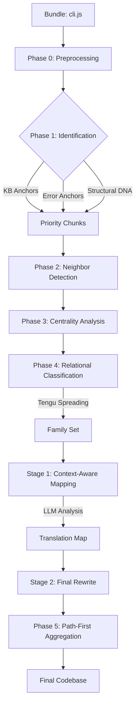

# Claude Code Cascade Analyzer

Pre-processor for CASCADE-style analysis of Claude Code bundles.

## Quickstart

```bash
cp .env.example .env
# Update .env with LLM api keys/model names
npm install
npm start
npm run deobfuscate
npm run deobfuscate -- <version> --rename-only
npm run assemble -- <version>
# Output will be in cascade_graph_analysis/<version>/final_codebase/
```

## Setup

Install dependencies:

```bash
npm install
```

## Usage

### Analyze

Run the analysis on a bundle. It defaults to searching for `./cli.js` or downloading the latest version from npm if not found.

```bash
npm start
```

To specify a path:

```bash
npm run analyze -- path/to/bundle.js
```

### Visualize

Start the interactive graph visualizer (WebGL powered by Sigma.js):

```bash
npm run visualize
```

Then open: [http://localhost:3000/visualizer/](http://localhost:3000/visualizer/)

### Deobfuscate (LLM Pipeline)

Start the context-aware deobfuscation pipeline. This requires an LLM API key.

1. **Setup `.env`**: Create a `.env` file in the root based on `.env.example`.
2. **Run Pipeline**: This process builds a global `mapping.json` using LLM analysis and then physically renames variables using Babel.

```bash
# Deobfuscate latest analysis
npm run deobfuscate

# Specify a target version (use -- to pass args to the script)
npm run deobfuscate -- 2.1.5

# Final Run: Rename Only (Skip LLM if mapping.json is already built)
npm run deobfuscate -- 2.1.5 --rename-only
```

The deobfuscated chunks will be saved to `cascade_graph_analysis/<version>/deobfuscated_chunks/`.

### Assemble Final Codebase

Organize the deobfuscated chunks into a coherent final codebase structure using **Path-First Aggregation**.

```bash
# Assemble the latest version
npm run assemble -- <version>
```

This script performs:
1.  **Trust the Knowledge Base (KB):** Uses `suggested_path` if available.
2.  **Trust the LLM:** Uses `suggestedFilename` placed in a subdirectory based on its `role`.
3.  **Filter by "Family":** Automatically skips vendor chunks.
4.  **Order by Source:** Merges multiple chunks into logical files, sorted by original `startLine`.

The final structured codebase will be located in `cascade_graph_analysis/<version>/final_codebase/`.

#### LLM Pipeline Details

The pipeline consists of two primary stages, orchestrated by `src/deobfuscate_pipeline.js`:
*   **Stage 1: Semantic Mapping (`src/deobfuscate_pipeline.js`)**
    *   **Logic**: Iterates through code chunks in order of **Centrality** (importance).
    *   **Prompt**: The core deobfuscation prompt is located in `src/deobfuscate_pipeline.js`. It injects metadata derived from `analyze.js` (Role, Label, State DNA) and existing mappings for consistency.
    *   **Persistence**: Discovered mappings are saved to `cascade_graph_analysis/<version>/metadata/mapping.json`.
*   **Stage 2: Safe Renaming (`src/rename_chunks.js`)**
    *   **Logic**: Uses Babel to perform scope-aware renaming of all identifiers found in `mapping.json`.
    *   **Output**: Generates readable JavaScript files in the `deobfuscated_chunks/` directory.

## Workflow

The analysis and deobfuscation process follows a multi-signal **Relational Identity System**:



### Phase 0: Preprocessing & AST Renaming
The target bundle is processed via `webcrack` to unminify code. The analyzer then dynamically detects runtime helpers (lazy loaders, CommonJS wrappers) and the `INTERNAL_STATE` object, applying global renaming to the AST before chunking.

### Phase 1: AST Identification (The DNA Scan)
The tree is split into logical functional chunks. Each chunk is scanned for:
- **Knowledge Base Anchors**: Trigger keywords from `knowledge_base.json`.
- **Error Fingerprinting**: Plain-text error strings (e.g., "Sandbox violation") that survive minification.
- **Structural DNA**: Chunks are tagged if they contain `async function*` (generators) or mutate `INTERNAL_STATE`.

### Phase 2 & 3: Neighbor Detection & Centrality
The analyzer builds a dependency graph of cross-references. A Markov Chain analysis calculates the centrality of each chunk, identifying the "Brain" of the application.

### Phase 4: Final Classification (Relational Identity)
- **Tengu Spreading**: Starting from "Founder" chunks (containing Tengu keywords or generators), the system iteratively infects neighbors. If 30% of a chunk's neighbors are "Family," it is categorized as Family.
- **Capability Analysis**: Roles (e.g., `SHELL_EXECUTOR`, `API_CLIENT`) are assigned based on Node.js module imports and structural signatures.
- **State DNA Mapping**: Accessors to `INTERNAL_STATE` (like `sessionId` or `totalCostUSD`) provide functional touchpoints.

### Stage 1 & 2: LLM Deobfuscation
The identified roles and State DNA are injected into LLM prompts. This leads to high-accuracy variable naming because the LLM knows, for example, that a `STREAM_ORCHESTRATOR` chunk is likely handling a `MessageStream`.

## Output

Results are saved to `cascade_graph_analysis/`:
- `chunks/`: Extracted functional chunks.
- `metadata/graph_map.json`: Graph structure and Markov centrality scores.

## Claude Code Obfuscation Analysis

An analysis of `claude-analysis/2.1.3/cli.js` (11MB bundle) reveals the following technical characteristics:

### Obfuscation Level
The code is **minified but not aggressively obfuscated**. It does not use advanced techniques like encrypted string tables, control flow flattening, or self-defending code. 

### Key Characteristics
- **Bundler**: Built using `esbuild`, identified by standard helper functions (`w`, `U`, `U5`) and lazy-load module initialization patterns.
- **Minification**: Local variable and function names are mangled (e.g., `hN9`, `_CA`), but high-level logic structures—such as classes and core control flows—remain discernable.
- **Dependency Aggregation**: The 11MB file is a standalone bundle containing numerous integrated dependencies, including `lodash`, `rxjs`, and various Node.js polyfills.
- **Internal Logic**: Logic for components like the native host (Chrome integration) and MCP (Model Context Protocol) clients is clearly visible as distinct classes (e.g., `Mz9`, `Rz9`).
- **Transparency**: Includes clear metadata such as build timestamps, versioning info, and even a recruitment message in the comments, suggesting the minification is for efficiency rather than secrecy.

## Project Structure

- `src/`: Core logic and helper scripts.
  - `analyze.js`: Entry point for codebase analysis and chunking.
  - `deobfuscate_pipeline.js`: Orchestrates the LLM deobfuscation stages.
  - `deobfuscation_helpers.js`: Specialized decoders and AST transformation utilities.
  - `llm_client.js`: Generic interface for LLM providers.
  - `rename_chunks.js`: Babel-powered variable renaming script.
- `visualizer/`: WebGL-based graph visualization tool.
- `run.js`: Central command runner and script orchestrator.
- `knowledge_base.json`: Seed data for functional identification.
- `cascade_graph_analysis/`: Output directory for analysis results and deobfuscated code.
