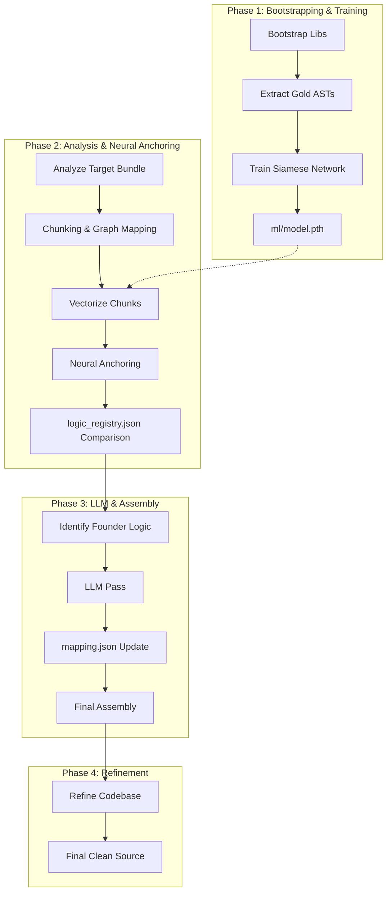

# Repository Architecture & AI Workflow

This document provides a detailed technical overview of the Claude Code Cascade Analyzer's architecture, its hybrid deobfuscation methodology, and the integrated AI workflow.

---

## 1. High-Level Methodology: Hybrid Differential Deobfuscation

The system employs a **Hybrid Differential Deobfuscation** approach. Instead of relying purely on pattern matching or LLMs, it combines three distinct domains to reconstruct obfuscated codebases:

1.  **Graph Theory & Static Analysis**: Understanding the relationship between code chunks, identifying entry points, and calculating importance (Markov Centrality).
2.  **Neural Fingerprinting**: Using a Siamese Triple Network to identify code based on its "Structural DNA" (AST topology) rather than literal content.
3.  **LLM Semantic Inference**: Using Large Language Models (LLMs) to reconstruct human-readable names and file structures for proprietary ("Founder") logic that lacks a public baseline.

---

## 2. System Components

The repository is partitioned into three main layers:

### A. Orchestration & AST Processing (Node.js)
- **`run.js`**: The central CLI entry point that manages environment variables (like `PYTHON_BIN`) and executes sub-processes.
- **`src/analyze.js`**: The core analyzer. It uses Babel to chunk large bundles, extract metadata, and identify structural signals.
- **`src/deobfuscate_pipeline.js`**: Manages the multi-stage LLM pass, handling JSON repair and scope-safe renaming.
- **`src/assemble_final.js`**: The reconstruction engine that uses dependency graphs to reassemble chunks into a coherent file tree.

### B. Machine Learning Core (Python/PyTorch)
- **`ml/encoder.py`**: Defines the `CodeStructureEncoder`, a Siamese architecture using Bidirectional LSTMs for structural encoding and MLP channels for literal fingerprints.
- **`ml/train.py`**: Implements the Triplet Loss training loop, teaching the model to ignore "surface noise" (renamed variables) and focus on "logic topology."
- **`ml/vectorize.py`**: Generates 64-dimensional L2-normalized embeddings (fingerprints) for code chunks.

### C. Knowledge & Metadata (JSON)
- **`knowledge_base.json`**: A curated database of known library "anchors" (keywords, error strings, unique patterns).
- **`logic_registry.json`**: A persistent database mapping structural vectors to confirmed library names and symbols.
- **`mapping.json`**: The version-specific result of the deobfuscation process, tracking every renamed identifier and its confidence score.

---

## 3. The AI Workflow (Step-by-Step)

### Step 1: Bootstrapping Library DNA
The system downloads known libraries (e.g., React, Zod, Anthropic SDK) and generates clean, "Gold Standard" structural fingerprints. This creates the baseline "Brain" of the system.

### Step 2: Training (Optional)
The Siamese Network is trained on the bootstrapped data. It learns that `function a(b) { return b + 1; }` is structurally identical to `function x(y) { return y + 1; }`, even if the names are changed.

### Step 3: Analysis & Chunking
The target bundle is broken down into small, manageable "chunks." The system calculates **Markov Centrality** scores to determine which chunks are the "heart" of the application (e.g., the main state machine or dispatcher).

### Step 4: Neural Anchoring
Every chunk in the target bundle is vectorized. These vectors are compared against the `logic_registry.json`.
- **Similarity > 0.95**: High-confidence library match. Symbols are automatically restored.
- **Similarity 0.90 - 0.94**: "Version Drift" detected. Flagged for partial anchoring or LLM review.
- **Similarity < 0.85**: Likely proprietary "Founder" logic.

### Step 5: LLM Deobfuscation
Chunks identified as "Founder" logic (unique to the application) are sent to an LLM. The LLM is provided with the chunk's code, its position in the dependency graph, and any partial anchors found nearby. It then generates human-readable names and suggests a file path.

### Step 6: Reconstruction
The final step uses the `mapping.json` to perform a scope-safe rename across all chunks and writes them to a new directory structure that mirrors the inferred original codebase.

### Step 7: Logic Refinement
The assembled codebase undergoes a final refinement pass (`npm run refine`). This stage uses an LLM to restore high-level control flow (converting complex ternary chains back to if/else blocks), remove lingering obfuscation boilerplate, and group related functions into logical modules.

---

## 4. Key Architectural Innovations

### The "Cold Start" Advantage
Because the NN is trained on structural patterns rather than specific hashes, it can identify a library version it has never seen before, provided it follows similar architectural patterns to other libraries in the training set.

### Literal Channels
The ML model doesn't just look at AST nodes; it hashes literals (strings, numbers) into a separate vector channel. This preserves "semantic texture" (like error messages or unique constants) without the model becoming overfit to specific variable names.

### Graph-Aware Deobfuscation
Most deobfuscators look at files in isolation. This system uses the dependency graph to propagate information. If `chunkA` is identified as "Gemini Client," and `chunkB` depends heavily on it, the LLM is primed to know that `chunkB` likely contains core AI orchestration logic.

---

## 5. Visualization Integration

The `visualizer/` directory contains a D3.js-based interface that allows developers to interactively explore the codebase's "Topology."
- **Nodes**: Chunks of code.
- **Edges**: Import/Export relationships.
- **Size**: Proportional to Markov Centrality (Importance).
- **Color**: Indicates whether a chunk is "Vendor" (Library) or "Founder" (App Logic).

---

For more details on specific components, see:
- [Neural Network Documentation](file:///Users/whit3rabbit/Documents/GitHub/cascade-like/docs/NN.md)
- [Data Schemas](file:///Users/whit3rabbit/Documents/GitHub/cascade-like/docs/SCHEMA.md)
