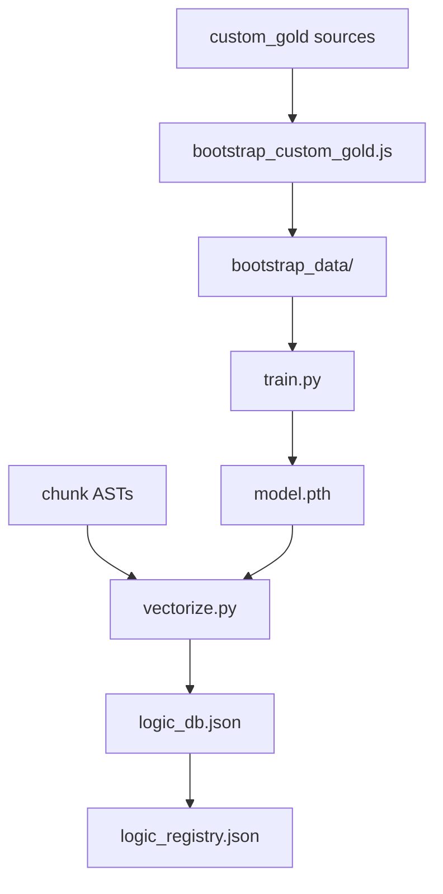
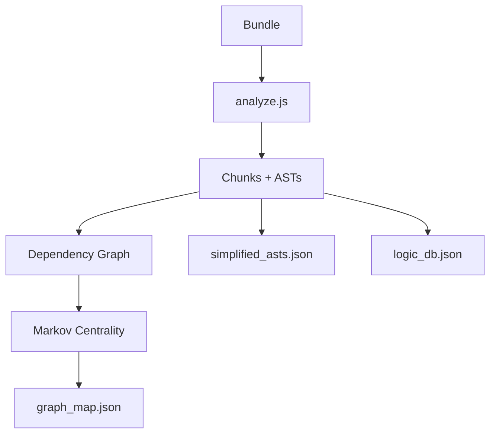
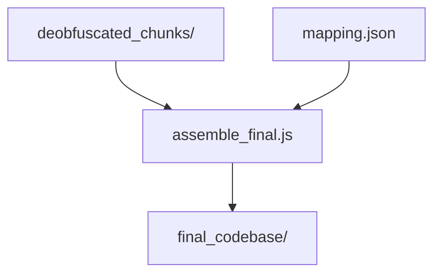

# Architecture: End-to-End Pipeline

This document is a step-by-step, in-depth description of the Claude Code Cascade Analyzer pipeline. The flow is intentionally linear and mirrors the `npm run full` workflow, with extra detail on inputs, outputs, and the data products that connect stages.

## Overall Diagram

```mermaid
flowchart TD
    subgraph ML["Step 1: Machine Learning"]
        ML1[Bootstrap Gold Sources] --> ML2[Train Transformer Encoder]
        ML2 --> ML3[Vectorize Chunks]
        ML3 --> ML4[logic_registry.json]
    end

    subgraph A["Step 2: Analysis Phase"]
        A1[Bundle Ingest] --> A2[Chunk + AST]
        A2 --> A3[Graph + Markov Centrality]
        A3 --> A4[graph_map.json + simplified_asts.json]
    end

    subgraph D["Step 3: Deobfuscation"]
        D1[Anchor to Registry] --> D2[Classify Roles]
        D2 --> D3[Propagate Names]
        D3 --> D4[LLM Deobfuscation]
        D4 --> D5[mapping.json + deobfuscated_chunks/]
    end

    subgraph S["Step 4: Assembly"]
        S1[Group by Path] --> S2[Deduplicate + Merge]
        S2 --> S3[final_codebase/]
    end

    subgraph R["Step 5: Refine"]
        R1[LLM Readability Pass] --> R2[final_codebase/ (refined)]
    end

    ML4 --> A1
    A4 --> D1
    D5 --> S1
    S3 --> R1
```

## Step 1: Machine Learning (Bootstrap + Train + Vectorize)

**Goal**: Build a structural fingerprinting model that recognizes libraries and stable logic patterns across versions while ignoring obfuscated names.



**Core components**
- Model: `ml/encoder.py`
- Training: `ml/train.py`
- Vectorization (inference): `ml/vectorize.py`
- Bootstrapping: `src/bootstrap_custom_gold.js` and `ml/bootstrap_data/`

**Bootstrap data (library DNA)**
- Purpose: create known-good structural fingerprints for common libraries and internal “gold” sources so the model has anchors.
- Source: `ml/custom_gold/` can hold clean source trees for specific versions or custom gold datasets.
- Process: `src/bootstrap_custom_gold.js` walks source trees, bundles with `esbuild` or `bun`, and produces reference chunks in `ml/bootstrap_data/`.
- Output: bootstrapped code is later embedded and stored in `cascade_graph_analysis/logic_registry.json` as canonical “gold” references for matching.

**Model architecture**
- Transformer encoder trained on structural AST sequences.
- `TransformerCodeEncoder` details (default hyperparams):
  - Embedding dim: 32
  - Hidden dim: 128
  - Heads: 8
  - Layers: 3
  - Output projection: 64-dim L2-normalized embedding
- Pooling: CLS token (first token representation after encoder)
- Input: flattened structural AST sequences (`ASTPreprocessor`) with padding to `MAX_NODES` and positional encodings.

**Training objective**
- Triplet loss (anchor, positive, negative) to maximize structural similarity within libraries and push apart unrelated structures.
- Key knobs in `ml/train.py`:
  - `--margin` (default 0.5; production preset uses higher margin)
  - `--embed_dim`, `--hidden_dim`, `--max_nodes`
  - Optional sweeps (`npm run train -- --sweep`)

**Inference / vectorization**
- `ml/vectorize.py` generates embeddings for each chunk’s structural AST plus a literal channel.
- Output file: `cascade_graph_analysis/<version>/metadata/logic_db.json`
  - Stores `vector_structural`, `vector_literals`, and symbol metadata.

**Artifacts produced**
- `ml/model.pth` (trained encoder weights)
- `ml/bootstrap_data/` (bundled gold references)
- `cascade_graph_analysis/logic_registry.json` (global registry of known vectors + resolved names)

## Step 2: Analysis Phase (Static Analysis + Graph + Markov Centrality)

**Goal**: Turn a bundle into chunked, analyzable units with graph metadata and structural ASTs. This is the foundation for anchoring, classification, and deobfuscation.



**Core component**
- `src/analyze.js`

**Bundle ingestion and chunking**
- The analyzer downloads or reads the target bundle, then uses Babel to parse and chunk it.
- `webcrack` and bundled helper heuristics are applied to expose module wrappers and inline definitions.
- Each chunk is stored under `cascade_graph_analysis/<version>/chunks/`.

**Knowledge base integration**
- `src/knowledge_base.js` loads `custom_knowledge_base.json` if present, otherwise `knowledge_base.json`.
- The knowledge base includes:
  - `file_anchors` (keyword triggers with weights and suggested paths)
  - `name_hints` (suggested identifier names)
  - `error_anchors` (error strings mapped to roles)
  - `structural_anchors` and `known_packages`
  - `project_structure` (used later for file placement and prompting)
- These signals are injected into `graph_map.json` metadata as hints.

**Graph construction**
- Neighbor discovery: identifiers that resolve to internal chunk definitions are linked.
- Soft cohesion: “identifier affinity” links sequential chunks when short variables flow across chunk boundaries.
- Centrality: a weighted PageRank/Markov chain variant computes importance scores.
  - Damping factor default: `0.85`
  - Edges toward priority (“founder”) chunks receive extra weight.
  - Sink nodes redistribute 85% to founder nodes and 15% globally.

**Analysis outputs**
- `cascade_graph_analysis/<version>/metadata/graph_map.json`
  - Chunk metadata, neighbors, centrality, roles, KB hints, and proposed paths.
- `cascade_graph_analysis/<version>/metadata/simplified_asts.json`
  - Structural ASTs stripped of names and values.
- `cascade_graph_analysis/<version>/metadata/logic_db.json`
  - Structural + literal embeddings (produced by ML inference).

## Step 3: Deobfuscation (Anchoring + Classification + Prompted LLM Pass)

**Goal**: Identify known libraries, classify chunks, propagate names, and use LLMs to resolve proprietary logic and propose file paths.

```mermaid
flowchart TD
    A1[logic_db.json] --> H1[anchor_logic.js]
    H1 --> M1[mapping.json (anchors)]
    M1 --> C1[classify_logic.js]
    C1 --> P1[propagate_names.js]
    P1 --> D1[deobfuscate_pipeline.js]
    D1 --> M2[mapping.json (LLM names)]
    D1 --> DC[deobfuscated_chunks/]
```

**Core components**
- `src/anchor_logic.js`
- `src/classify_logic.js`
- `src/propagate_names.js`
- `src/deobfuscate_pipeline.js`
- `src/rename_chunks.js`

**Anchoring to known libraries**
- `anchor_logic.js` compares each chunk’s vectors against `logic_registry.json`.
- High-similarity matches import known symbol names and file hints into `mapping.json`.
- This creates high-confidence “library anchors” that reduce LLM workload.

**Classification**
- `classify_logic.js` assigns roles such as `VENDOR_LIBRARY`, `CORE_MODULE`, or `APP_LOGIC`.
- Centrality, KB hints, and anchor confidence drive the labels.

**Name propagation**
- `propagate_names.js` spreads high-confidence names to neighboring chunks.
- This improves LLM context and reduces ambiguous single-letter identifiers.

**LLM deobfuscation pipeline**
- `deobfuscate_pipeline.js` runs a multi-pass process:
  - Consolidation pass groups hard- and soft-linked chunks into a single file path.
  - Main LLM pass resolves unknown variables/properties and proposes a path.
  - Incremental syncing writes deobfuscated chunks immediately for later assembly.
- Prompt context includes:
  - Proposed or inferred file path.
  - Neighbor list and neighbor paths.
  - High-confidence mappings from `mapping.json`.
  - Gold reference code when similarity ≥ 0.95.
  - Project structure reference from `structrecc.md` (if present) and KB `project_structure`.
  - Current “filesystem state” (already confirmed paths).
- Output format is strict JSON:
  - `mappings.variables` and `mappings.properties`
  - `corrections` for bad prior mappings
  - `suggestedPath`

**Structure guidance inputs**
- `structrecc.md` (optional, loaded and truncated by `STRUCTURE_MD_LIMIT`)
- `knowledge_base.json` `project_structure` (directory and file layout)
- These two sources directly constrain path suggestions.

**Deobfuscation output**
- `cascade_graph_analysis/<version>/metadata/mapping.json`
  - Central registry of renamed identifiers, confidence, and source.
- `cascade_graph_analysis/<version>/deobfuscated_chunks/`
  - Per-chunk code with safe renames applied and metadata headers.

## Step 4: Assembly (Rebuild the Codebase)

**Goal**: Convert deobfuscated chunks into a coherent, structured source tree that mirrors the inferred original project.



**Core component**
- `src/assemble_final.js`

**Key behaviors**
- Path-first aggregation: chunks are grouped by `suggestedPath` / `proposedPath` from the LLM and KB.
- Deduplicating merge: module wrappers and redundant helpers are stripped.
- Affinity and module-id hints are used to merge split chunks into a single file.

**Output**
- `cascade_graph_analysis/<version>/final_codebase/`
  - Assembled file tree with inferred paths and deobfuscated identifiers.

## Step 5: Refine (LLM Readability Pass)

**Goal**: Improve readability and restore control-flow structure after assembly.

```mermaid
flowchart TD
    F1[final_codebase/] --> R1[refine_codebase.js]
    R1 --> F2[final_codebase/ (refined)]
```

**Core component**
- `src/refine_codebase.js`

**Refinement behavior**
- Uses `structrecc.md` as a structure reference when present.
- Rewrites overly-minified control flow (nested ternaries, flattened loops).
- Cleans dead branches and improves semantic clarity without changing behavior.

**Output**
- `cascade_graph_analysis/<version>/final_codebase/` (refined in-place)

## Supporting Files and “Single Source of Truth”

These are the core files that tie the pipeline together:
- `knowledge_base.json` or `custom_knowledge_base.json` for anchors and structure.
- `structrecc.md` for authoritative project structure guidance in LLM prompts.
- `cascade_graph_analysis/logic_registry.json` for global vector-to-name anchors.
- `cascade_graph_analysis/<version>/metadata/graph_map.json` for analysis metadata.
- `cascade_graph_analysis/<version>/metadata/logic_db.json` for ML vectors.
- `cascade_graph_analysis/<version>/metadata/mapping.json` for naming decisions.

## Typical Flow (Commands)

Standard flow (analysis + anchor/classify/propagate/rename + LLM + assemble + refine):
```
node run analyze --version <version>
node run deobfuscate <version> --skip-vendor
node run assemble <version>
node run refine <version>
```

Manual flow (run anchor/classify/propagate separately after analysis):
```
node src/analyze.js --version <version>
node src/anchor_logic.js <version> [reference_version]
node src/classify_logic.js <version>
node src/propagate_names.js <version>
node src/rename_chunks.js <version>
node src/deobfuscate_pipeline.js <version> --skip-vendor
node src/assemble_final.js <version>
node src/refine_codebase.js <version>
```

One-shot workflow:
```
node run full --version <version>
```

Bootstrap + training (optional, for updating the model and anchors):
```
node run bootstrap
node run train -- --preset production
```
