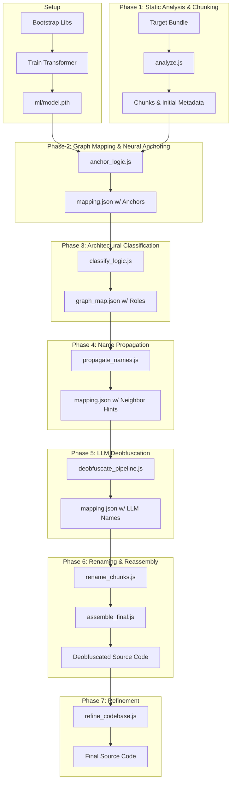

# Repository Architecture & AI Workflow

This document provides a detailed technical overview of the Claude Code Cascade Analyzer's architecture, its hybrid deobfuscation methodology, and the integrated AI workflow.

---

## 1. High-Level Methodology: Hybrid Differential Deobfuscation

The system employs a **Hybrid Differential Deobfuscation** approach. Instead of relying purely on pattern matching or LLMs, it combines three distinct domains to reconstruct obfuscated codebases:

1.  **Graph Theory & Static Analysis**: Understanding the relationship between code chunks, identifying entry points, and calculating importance (Markov Centrality/PageRank).
2.  **Neural Fingerprinting**: Using a **Transformer Encoder** (Siamese Network) with CLS pooling to identify code based on its "Structural DNA" (AST topology) while retaining a separate literal channel.
3.  **LLM Semantic Inference**: Using Large Language Models (LLMs) to reconstruct human-readable names and file structures for proprietary ("Founder") logic that lacks a public baseline.

---

## 2. System Components & Orchestration

The repository is managed by a central script, `run.js`, which orchestrates the entire deobfuscation pipeline. The system is partitioned into three main layers:

### A. Orchestration & AST Processing (Node.js)
- **`run.js`**: The main entry point for all operations. It provides commands to run individual pipeline stages or the `full` end-to-end workflow.
- **`src/analyze.js`**: The core analyzer. It uses Babel to chunk large bundles, extract metadata, detected "Module Envelopes" for logical grouping, and calculates Identifier Affinity scores.
- **`src/anchor_logic.js`**: Bridges Node.js orchestration with Python inference. It handles logic registry synchronization, vectorization commands, and aligns symbols between target and gold-standard chunks.
- **`src/classify_logic.js`**: Assigns architectural roles and proposed paths based on graph metrics and anchor metadata.
- **`src/propagate_names.js`**: Spreads high-confidence names to neighboring chunks in the dependency graph to provide better context for the LLM.
- **`src/deobfuscate_pipeline.js`**: Manages the multi-stage LLM pass, including the **Consolidation Pass** for grouped chunks and inherited scope mapping. It generates the `mapping.json` file.
- **`src/rename_chunks.js`**: Consumes `mapping.json` to apply a safe, scope-aware rename pass across the entire AST.
- **`src/assemble_final.js`**: The reconstruction engine that performs **Deduplicating Merges** to strip module wrappers and reassemble split chunks into clean files.
- **`src/refine_codebase.js`**: Performs a final LLM pass on the assembled code to improve readability (e.g., converting ternary operators to `if/else` statements).

### B. Machine Learning Core (Python/PyTorch)
- **`ml/encoder.py`**: Defines the `TransformerCodeEncoder`. It uses a Transformer Encoder with CLS pooling to generate fixed-size (64-dim) embeddings from AST sequences.
- **`ml/train.py`**: Implements the Triplet Loss training loop with "Nuclear Options" (Literal Dropout, Sequence Jittering, Node Masking) to force structural learning.
- **`ml/vectorize.py`**: Generates 64-dimensional L2-normalized structural and literal embeddings for code chunks.

### C. Knowledge & Metadata (JSON)
- **`knowledge_base.json`**: A curated database of known library "anchors" (keywords, error strings, unique patterns).
- **`cascade_graph_analysis/logic_registry.json`**: A persistent database mapping structural vectors to confirmed library names and symbols.
- **`cascade_graph_analysis/<version>/metadata/mapping.json`**: The version-specific result of the deobfuscation process, tracking every renamed identifier and its confidence score.

---

## 3. The AI Workflow (Step-by-Step)

The `run.js` script orchestrates the pipeline via the `full` command.

### Phase 1: Static Analysis & Chunking (`analyze.js`)
The target bundle is ingested by `analyze.js`. The script performs initial static analysis to identify module wrappers, hard-coded signals, and potential entry points. It then breaks down the large bundle into small, manageable "chunks" based on token count and syntactic boundaries, creating a dependency graph.

### Phase 2: Neural Anchoring (`anchor_logic.js`)
Every chunk is vectorized by the pre-trained ML model (`ml/model.pth`) to create **structural + literal fingerprints**. These vectors are compared against a registry of known libraries (`logic_registry.json`) using a weighted similarity score. High-similarity matches are "anchored," and their known variable and function names are added to the `mapping.json` file with high confidence.

### Phase 3: Architectural Classification (`classify_logic.js`)
The classifier script uses the graph metrics (centrality) and anchoring results (library vs. unknown) to assign architectural roles to each chunk (e.g., `VENDOR_LIBRARY`, `APP_LOGIC`, `CORE_MODULE`). This crucial step determines which code is proprietary and requires LLM analysis.

### Phase 4: Name Propagation (`propagate_names.js`)
This script propagates high-confidence names from anchored chunks to their immediate neighbors in the dependency graph. This provides the LLM with more context for deobfuscating unknown code.

### Phase 5: LLM Deobfuscation (`deobfuscate_pipeline.js`)
Chunks identified as "Founder" (proprietary) logic are sent to a Large Language Model. The LLM is prompted with the chunk's code, its neighbors' names, and any partial matches to infer the original, human-readable names for variables and functions.

### Phase 6: Renaming & Reassembly (`rename_chunks.js` & `assemble_final.js`)
First, `rename_chunks.js` applies the renames from `mapping.json` to the chunk files. Then, `assemble_final.js` uses the completed `mapping.json` to reconstruct the deobfuscated chunks into a clean, new directory structure that mirrors the inferred original codebase.

### Phase 7: Refinement (`refine_codebase.js`)
`refine_codebase.js` performs a final LLM-driven pass to restore high-level control flow, converting complex ternary chains back into readable `if/else` blocks and removing other obfuscation artifacts.

### Iterative Discovery
The repository includes a "Frontier Crawler" script (`src/discovery_walk.js`) that allows for iterative analysis. After an initial analysis pass, this script can be run to identify unanalyzed neighboring chunks. It uses outbound connections from known modules and Markov centrality scores to intelligently expand the analysis frontier, guiding the deobfuscation process into previously unexplored parts of the codebase.

---

## 4. Advanced Chunk Reconstruction (The "Holy Grail")

To solve the problem of identifying which split chunks belong to the same original source file, the system uses a multi-tiered signal detection system.

### A. Hard Signal: Module Envelopes
The analyzer (`src/analyze.js`) detects bundler wrappers (e.g., `__commonJS`, `__lazyInit`) and assigns a persistent `moduleId` to all chunks contained within the wrapper. This effectively groups split parts of a large module together.

### B. Soft Signal: Identifier Affinity
We calculate a **Cohesion Score** between adjacent chunks based on the continuity of short, scoped variables (e.g., `_a`, `x`). If Chunk A defines `_a` and Chunk B immediately uses it, an **Affinity Link** is established, treating them as a logical continuum.

### C. Consolidation & Deduplication
- **Consolidation Pass**: Before deobfuscation, a "Consolidation Pass" groups linked chunks and prompts the LLM to identify the single "Unified Path" for the group.
- **Deduplicating Merge**: During assembly (`src/assemble_final.js`), module wrappers and redundant helpers are stripped, merging the bodies of split chunks into a clean, singular file.

*For a deep dive on the math and logic, see [Advanced Chunk Reconstruction](CHUNKS.md).*

---

## 5. Key Architectural Innovations

### The "Cold Start" Advantage
Because the NN is trained on structural patterns rather than specific hashes, it can identify a library version it has never seen before, provided it follows similar architectural patterns to other libraries in the training set.

### Literal Hashing & Dropout
The ML model uses a separate channel for literals (strings, numbers) with sinusoidal encoding and dropout during training. This teaches the model to use literals as helpful hints when available, but not to depend on them, making it robust against string encryption or modification.

### Graph-Aware Deobfuscation
Most deobfuscators look at files in isolation. This system uses the dependency graph to propagate information. If `chunkA` is identified as "Gemini Client," and `chunkB` depends heavily on it, the LLM is primed to know that `chunkB` likely contains core AI orchestration logic.

---

## 6. Visualization Integration

The `visualizer/` directory contains a D3.js-based interface that allows developers to interactively explore the codebase's "Topology."
- **Nodes**: Chunks of code.
- **Edges**: Import/Export relationships.
- **Size**: Proportional to Markov Centrality (Importance).
- **Color**: Indicates whether a chunk is "Vendor" (Library) or "Founder" (App Logic).